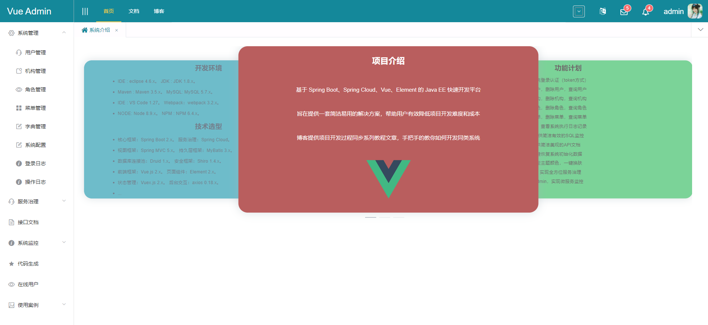

# spring-cloud-vue-admin

基于Spring Cloud和Vue最近版本的权限管理系统，预览地址

## 功能

> ✔ 表示已完成，✘表示正在开发中

+ ✔ 系统登录：系统用户登录，系统登录认证（jwt token方式）
+ ✔ 用户管理：新建用户，修改用户，删除用户，查询用户
+ ✔ 机构管理：新建机构，修改机构，删除机构，查询机构
+ ✔ 角色管理：新建角色，修改角色，删除角色，查询角色
+ ✔ 菜单管理：新建菜单，修改菜单，删除菜单，查询菜单
+ ✔ 系统日志：记录用户操作日志，查看系统执行日志记录
+ ✔ 数据监控：定制Druid信息，提供简洁有效的SQL监控
+ ✔ 聚合文档：Swagger在线文档，提供简洁美观的API文档
+ ✔ 主题切换：支持主题切换，自定主题颜色，一键换肤
+ ✘ 服务治理：集成Spring Cloud，实现全方位服务治理
+ ✘ 服务监控：集成Spring Boot Admin，实现微服务监控

## 开发环境

### 后端

+ IDE : IDEA2019.2
+ JDK : JDK 1.8.0_212
+ Maven : Maven 3.6.2
+ MySQL: MySQL 5.7.15

### 前端

+ IDE : WebStorm 2019.2.4
+ Webpack：webpack 4.41.2
+ NODE: Node 10.16.3
+ NPM : NPM 6.9.0

## 技术选型

### 后端

+ 核心框架：Spring Boot 2.1.1.RELEASE
+ 服务治理：Spring Cloud Finchley.RELEASE
+ 持久层框架：MyBatis 3.4.6
+ 数据库连接池：Druid 1.1.10
+ 安全框架：Spring Security 5.1.2 + JWT 0.9.1
+ 接口文档：Swagger 2.9.2

### 前端

+ 前端框架：Vue.js 2.6.10
+ 页面库：Element 2.13.0
+ 状态管理：Vuex 3.0.1
+ 路由管理：Vue Router 3.1.3
+ 后台交互：axios 0.19.0
+ 脚手架：Vue Cli 4.0.5
+ 图标库：FontAwesome 4.7.0
+ 国际化：i18n 8.15.0

## 参考资料

+ [Spring Cloud](https://spring.io/projects/spring-cloud)
+ [Vue](https://cn.vuejs.org)
+ [Element](https://element.eleme.cn/#/zh-CN)
+ [Spring Boot+Spring Cloud+Vue+Element项目实战 by 徐立健](https://item.jd.com/12624380.html)